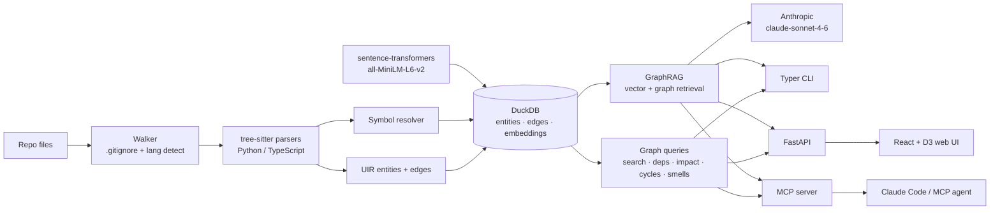

# CodeGraph (IN DEVELOPMENT)

**A local-first AI memory layer for your codebase.** Index a Python or TypeScript
repo into a queryable graph, search it by meaning, ask grounded questions over a
local + Anthropic GraphRAG pipeline, explore it in a browser and expose it all
to your coding agent over MCP.


> Everything runs on your machine. The only network call is the Anthropic API for
> `ask` / `summarize` (optional — all graph and search features work offline).

## What it does

- **Understands your code as a graph** — tree-sitter parses 9 languages (Python,
  TypeScript/JS, Go, Rust, Java, Ruby, PHP, C, C++) into a unified entity/edge model
  (functions, classes, methods, modules + `imports`/`calls` edges), stored in a single
  DuckDB file with cross-file symbol resolution.
- **Search by meaning, not just text** — local `all-MiniLM-L6-v2` embeddings + DuckDB
  vector search, fused with literal search via Reciprocal Rank Fusion.
- **Answers grounded questions** — GraphRAG retrieval (vector seeds + graph expansion)
  feeds `claude-sonnet-4-6` to answer "how does X work?" with `file:line` citations.
- **Analyzes structure** — dependency trees, reverse-call impact, import-cycle detection
  (Tarjan SCC), code-smell heuristics, dead-code candidates, git-blame ownership, and
  architectural layer analysis.
- **Stays fresh automatically** — `codegraph watch` debounces filesystem events and
  re-indexes only the changed files in ~300 ms, keeping the graph current as you code.
- **Plugs into any MCP agent** — 8 MCP tools (search, context, trace, impact, status,
  …) plus a one-command installer for Claude Code, Cursor, Codex, and Gemini.

## Quickstart

```bash
uv sync --extra dev

# Index a repo (writes .codegraph/graph.duckdb + embeddings)
uv run codegraph index /path/to/repo

# Search, explore, ask
uv run codegraph search "user authentication"
uv run codegraph impact authenticate
uv run codegraph ask "how does login work?"      # needs ANTHROPIC_API_KEY

# Browser UI: D3 graph + search + streaming AI chat
uv run codegraph serve
```

Full command list: `uv run codegraph --help` — `index`, `search`, `deps`, `impact`,
`cycles`, `smells`, `deadcode`, `owner`, `layers`, `ask`, `summarize`, `context`,
`trace`, `status`, `watch`, `serve`, `install`, `uninstall`.

## Example queries

**Semantic search** finds code by intent, even when the words don't match:

```text
$ codegraph search "user authentication"
Type      Name          Location              Via              Doc
function  authenticate  auth/login.py:9       literal+semantic Validate credentials...
```

**Impact analysis** shows the reverse-call blast radius:

```text
$ codegraph impact authenticate
authenticate (function, auth/login.py:9)
+-- called by login_handler (method, api/users.py:26)
+-- called by submit (method, auth/login.py:38)
`-- called by boot (function, main.py:15)
Blast radius: 3 entities across 3 hop(s).
```

**Grounded Q&A** cites the actual entities it used:

```text
$ codegraph ask "how does login work?"
Login is handled by [py:auth/login.py:authenticate], which validates credentials
and is invoked by the API route [py:api/users.py:login_handler]...
```

## Architecture



## Agent installer

`codegraph install` wires the MCP server into your agent in one command — no manual
JSON editing needed.

```bash
# Index your repo first
uv run codegraph index /path/to/repo

# Install into Claude Code (writes ~/.claude.json)
uv run codegraph install claude --db /path/to/repo/.codegraph/graph.duckdb

# Install into Cursor (writes ~/.cursor/mcp.json)
uv run codegraph install cursor --db /path/to/repo/.codegraph/graph.duckdb

# Dry-run: print the JSON snippet without writing
uv run codegraph install claude --db ... --print-config

# Remove the entry
uv run codegraph uninstall claude
```

**Supported targets:**

| Target | Command | Global config written |
|---|---|---|
| `claude` | Claude Code | `~/.claude.json` |
| `cursor` | Cursor IDE | `~/.cursor/mcp.json` |
| `codex` | OpenAI Codex CLI | `~/.codex/config.json` |
| `gemini` | Google Gemini CLI | `~/.gemini/settings.json` |

Use `--location local` to write a project-scoped config instead (`.mcp.json`,
`.cursor/mcp.json`, etc.). Use `--yes`/`-y` to skip the confirmation prompt in scripts.

Then ask your agent: *"Use codegraph to explain how authentication works in this repo."*

## MCP tools

CodeGraph exposes 8 tools over the [MCP](https://modelcontextprotocol.io) stdio protocol.

| Tool | What it does |
|---|---|
| `get_context` | **Primary tool.** One call = hybrid search + full source + callers/callees. Replaces 3-4 round-trips. |
| `search_code` | Hybrid literal + semantic search -> entities with `file:line` |
| `get_entity_context` | Full source + neighbours (`depends_on`, `called_by`) for an `entity_id` |
| `impact_analysis` | Reverse-call blast radius -- what breaks if an entity changes |
| `trace_path` | Shortest call chain between two `entity_id`s (BFS, up to 7 hops) |
| `list_files` | All indexed files with language, LOC, and entity count; filterable by language |
| `index_status` | File / entity / edge / embedding counts + staleness indicator |
| `ask_codebase` | Natural-language question answered via GraphRAG with citations |

`ask_codebase` requires embeddings and `ANTHROPIC_API_KEY`; all others work on any index.
Set `CODEGRAPH_DB` to override the default DB path without passing `--db`.

To run the MCP server manually (e.g. for a custom agent config):

```bash
python -m codegraph.server.mcp_server --db /path/to/repo/.codegraph/graph.duckdb
```

## Stack

| Layer | Choice |
|---|---|
| Language / tooling | Python 3.11, [uv](https://github.com/astral-sh/uv), [ruff](https://docs.astral.sh/ruff/), pytest |
| Parsing | [tree-sitter](https://tree-sitter.github.io/) — Python, TS/JS, Go, Rust, Java, Ruby, PHP, C, C++ |
| Storage | [DuckDB](https://duckdb.org/) — entities, edges, `FLOAT[384]` vectors, one file |
| Embeddings | [sentence-transformers](https://www.sbert.net/) `all-MiniLM-L6-v2` (local, 384-d) |
| LLM | [Anthropic](https://docs.anthropic.com/) `claude-sonnet-4-6` (prompt-cached) |
| Freshness | [watchdog](https://github.com/gorakhargosh/watchdog) — debounced file watcher |
| CLI | [Typer](https://typer.tiangolo.com/) + [Rich](https://rich.readthedocs.io/) |
| Web | [FastAPI](https://fastapi.tiangolo.com/) + React 19 + Vite + [D3](https://d3js.org/) |
| Agent | [MCP Python SDK](https://github.com/modelcontextprotocol/python-sdk) |

## Benchmarks

Indexing [`tiangolo/fastapi`](https://github.com/tiangolo/fastapi) (1,122 files) on a
laptop — **6,065 entities, 14,601 edges**:

| Metric | Result |
|---|---|
| Cold index (parse + resolve, graph only) | ~67 s |
| Warm re-index (no changes, hash-skip) | ~1.9 s |
| Literal search query | <1 ms p50 / ~16 ms p95 (in-process) |
| Embedding throughput | ~690 entities/s (`all-MiniLM-L6-v2`, CPU) |
| Graph DB size on disk | ~34 MB |

`search get_swagger_ui_html` → `fastapi/openapi/docs.py:40`. Warm re-index is ~35×
faster than cold thanks to per-file SHA-256 hash-skipping; embeddings re-compute only
for entities whose input changed. `ask` latency depends on the Anthropic API.

[TEST RESULTS ARE SIMULATED WITH SCRIPTS NOT MANUALLY] 

## Roadmap

Phases 10-13 ("best of both") are complete:

- **Phase 10** — 9 languages: Go, Rust, Java, Ruby, PHP, C, C++ added to Python + TS/JS
- **Phase 11** — `codegraph watch`: debounced file watcher re-indexes in ~300 ms; staleness guard on `serve`/MCP startup
- **Phase 12** — 8 MCP tools: `get_context` (3-in-1), `trace_path` (BFS), `list_files`, `index_status` + CLI mirrors (`context`, `trace`, `status`)
- **Phase 13** — Agent installer: `codegraph install`/`uninstall` for Claude Code, Cursor, Codex, Gemini

Deliberately **deferred**: deep TypeScript type resolution via `tsc`, framework-aware
resolvers (Express/NestJS/Django/Rails), multi-client shared watcher daemon (Unix
socket), and cross-language HTTP edge extraction. See [STATUS.md](STATUS.md).

Other github repos consisting of architectural memoery does not solve the semantic meaning for the codebase,
Which in development, models have to go through the whole code bases again defeating the point for
CODEGRAPHS.

## Acknowledgments

Built on [tree-sitter](https://tree-sitter.github.io/), [DuckDB](https://duckdb.org/),
[sentence-transformers](https://www.sbert.net/), and the
[Anthropic API](https://docs.anthropic.com/). Progress tracked in [STATUS.md](STATUS.md).

**RESEARCH**
Its inspired by open source projects that solve the similar problem but on base levels, open source research papers
also does not define a real problem solving tool that can actually be combined with agentic development tools for 
product Development
