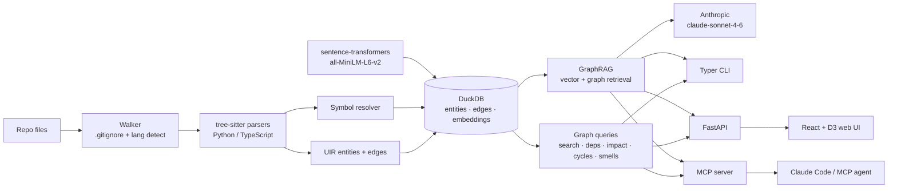

# CodeGraph

**A local-first AI memory layer for your codebase.** Index a Python or TypeScript
repo into a queryable graph, search it by meaning, ask grounded questions over a
local + Anthropic GraphRAG pipeline, explore it in a browser — and expose it all
to your coding agent over MCP.


> Everything runs on your machine. The only network call is the Anthropic API for
> `ask` / `summarize` (optional — all graph and search features work offline).

## What it does

- **Understands your code as a graph** — tree-sitter parses Python & TypeScript into a
  unified entity/edge model (functions, classes, methods, modules + `imports`/`calls`
  edges), stored in a single DuckDB file with cross-file symbol resolution.
- **Search by meaning, not just text** — local `all-MiniLM-L6-v2` embeddings + DuckDB
  vector search, fused with literal search via Reciprocal Rank Fusion.
- **Answers grounded questions** — GraphRAG retrieval (vector seeds + graph expansion)
  feeds `claude-sonnet-4-6` to answer "how does X work?" with `file:line` citations.
- **Analyzes structure** — dependency trees, reverse-call impact ("what breaks if I
  change this?"), import-cycle detection (Tarjan SCC), and code-smell heuristics.
- **Plugs into your agent** — an MCP server lets Claude Code (or any MCP client) call
  CodeGraph as a tool.

## Quickstart

```bash
uv sync --extra dev

# Index a repo (writes .codegraph/graph.duckdb + embeddings)
uv run codegraph index /path/to/repo

# Search, explore, ask
uv run codegraph search "user authentication"
uv run codegraph impact authenticate
uv run codegraph ask "how does login work?"      # needs ANTHROPIC_API_KEY

# Browser UI: D3 graph + search + streaming AI chat
uv run codegraph serve
```

Full command list: `uv run codegraph --help` — `index`, `search`, `deps`, `impact`,
`cycles`, `smells`, `ask`, `summarize`, `serve`.

## Example queries

**Semantic search** finds code by intent, even when the words don't match:

```text
$ codegraph search "user authentication"
Type      Name          Location              Via              Doc
function  authenticate  auth/login.py:9       literal+semantic Validate credentials...
```

**Impact analysis** shows the reverse-call blast radius:

```text
$ codegraph impact authenticate
authenticate (function, auth/login.py:9)
+-- called by login_handler (method, api/users.py:26)
+-- called by submit (method, auth/login.py:38)
`-- called by boot (function, main.py:15)
Blast radius: 3 entities across 3 hop(s).
```

**Grounded Q&A** cites the actual entities it used:

```text
$ codegraph ask "how does login work?"
Login is handled by [py:auth/login.py:authenticate], which validates credentials
and is invoked by the API route [py:api/users.py:login_handler]...
```

## Architecture



## MCP integration

CodeGraph ships an [MCP](https://modelcontextprotocol.io) server so an agent can query
your code as a tool.

```bash
uv run codegraph index /path/to/repo
claude mcp add codegraph -- \
  uv run python -m codegraph.server.mcp_server --db /path/to/repo/.codegraph/graph.duckdb
```

Then ask your agent: *"Use codegraph to explain how authentication works in this repo."*

| Tool | What it does |
|---|---|
| `search_code` | Hybrid literal + semantic search → entities with `file:line` |
| `get_entity_context` | Full source + neighbours (`depends_on`, `called_by`) for an `entity_id` |
| `impact_analysis` | Reverse-call blast radius — what breaks if an entity changes |
| `ask_codebase` | Natural-language question answered via GraphRAG with citations |

`ask_codebase` needs embeddings (don't index with `--no-embed`) and `ANTHROPIC_API_KEY`;
the other three work on any index. The DB path may also be set via `CODEGRAPH_DB`.

## Stack

| Layer | Choice |
|---|---|
| Language / tooling | Python 3.11, [uv](https://github.com/astral-sh/uv), [ruff](https://docs.astral.sh/ruff/), pytest |
| Parsing | [tree-sitter](https://tree-sitter.github.io/) (Python, TypeScript/TSX, JS/JSX) |
| Storage | [DuckDB](https://duckdb.org/) — entities, edges, `FLOAT[384]` vectors, one file |
| Embeddings | [sentence-transformers](https://www.sbert.net/) `all-MiniLM-L6-v2` (local, 384-d) |
| LLM | [Anthropic](https://docs.anthropic.com/) `claude-sonnet-4-6` (prompt-cached) |
| CLI | [Typer](https://typer.tiangolo.com/) + [Rich](https://rich.readthedocs.io/) |
| Web | [FastAPI](https://fastapi.tiangolo.com/) + React 19 + Vite + [D3](https://d3js.org/) |
| Agent | [MCP Python SDK](https://github.com/modelcontextprotocol/python-sdk) |

## Benchmarks

Indexing [`tiangolo/fastapi`](https://github.com/tiangolo/fastapi) (1,122 files) on a
laptop — **6,065 entities, 14,601 edges**:

| Metric | Result |
|---|---|
| Cold index (parse + resolve, graph only) | ~67 s |
| Warm re-index (no changes, hash-skip) | ~1.9 s |
| Literal search query | <1 ms p50 / ~16 ms p95 (in-process) |
| Embedding throughput | ~690 entities/s (`all-MiniLM-L6-v2`, CPU) |
| Graph DB size on disk | ~34 MB |

`search get_swagger_ui_html` → `fastapi/openapi/docs.py:40`. Warm re-index is ~35×
faster than cold thanks to per-file SHA-256 hash-skipping; embeddings re-compute only
for entities whose input changed. `ask` latency depends on the Anthropic API.

## Roadmap

CodeGraph is an MVP carve-out of a larger vision. Deliberately **deferred**: more
language parsers (Rust/Java/Go/etc.), deep TypeScript type resolution via `tsc`,
git-blame/ownership overlays, antipattern/architecture detection, a background
re-indexing daemon, and cross-language HTTP edges. See [plan/09-stretch.md](plan/09-stretch.md).

## Acknowledgments

Built on [tree-sitter](https://tree-sitter.github.io/), [DuckDB](https://duckdb.org/),
[sentence-transformers](https://www.sbert.net/), and the
[Anthropic API](https://docs.anthropic.com/). Progress tracked in [STATUS.md](STATUS.md).
