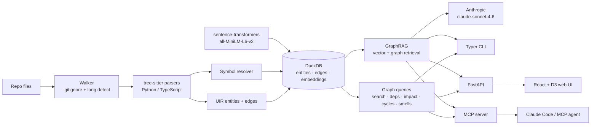

# Kortex (A CodeGraph local first tool)

**A local-first AI memory layer for your codebase.** Index a repo (22 languages) into a
queryable graph, search it by meaning, ask grounded questions over a local + Anthropic
GraphRAG pipeline, explore it in a browser, and expose it all to your coding agent over
MCP — so the agent queries the graph instead of re-reading your files every message.

> **Status: active development.** Core indexing, search, and MCP tools are stable.
> 778 tests passing. Every user-facing surface manually tested — 21/21 passed, 6 issues
> fixed. [Manual test →](docs/MANUAL_TEST_REPORT.md) | [Bench notes →](docs/QUALITY_REPORT_2026-07-01.md).
> MCP server works but still preview, not production-ready.


> Everything runs on your machine. The only network call is the Anthropic API for
> `ask` / `summarize` (optional — all graph and search features work offline).

---

## Changelog

**Jul 2026**

- `get_context` now warns when your index is stale — tells you how many files changed and
  to run `reindex` before trusting results. Previously you had to call `index_status`
  yourself to find this out, which most agents skip.
- 778 tests, 0 failures. Added 4 tests for the stale warning.
- Ran proper token savings numbers across queries on this repo: **101x average**
  (12x on a tiny single-function file at worst, 190x best case). One example:
  1,108 vs 10,637 tokens. [Bench notes →](docs/QUALITY_REPORT_2026-07-01.md)
- Hit@1 was 7/7 on symbol lookups where the function name doesn't appear in the
  query at all (pure semantic match).
- Warm query latency ~15ms; stale check is <1ms once the TTL cache is warm.

---

## License & attribution

**Kortex is source-available, not open-source.** It is licensed under the
[PolyForm Noncommercial License 1.0.0](LICENSE).

**You may:**
- Read the code, learn from it, and run it locally for your own work.
- Modify it and contribute changes back via pull requests.
- Use it personally, for research, hobby projects, study, or inside a nonprofit /
  educational / public-sector organization.

**You may NOT:**
- Use it commercially — selling it, hosting it as a paid service, embedding it in a
  product you sell, or shipping it as part of a for-profit offering.
- Re-publish it under your own name, rebrand it, or claim it as your own work.

**For commercial use,** contact me via my GitHub profile: [github.com/kunal202426](https://github.com/kunal202426).

Built and maintained by **Kunal Mathur**. Every source file carries an attribution
header — please keep it intact in copies and forks.

---

## In plain words 

This codebase is like a **huge library full of books** (each file is a book).

- **Without Kortex:** every time you ask the AI a question, it grabs **armfuls of whole
  books** and flips through all of them — every single time. Heavy, slow, and it still
  struggles to see how one book references another.
- **With Kortex:** a librarian has already read every book once and built a **card
  catalog** — who mentions whom, who calls what. Now when you ask a question, the librarian
  hands the AI just **the 2–3 exact pages that matter**, plus a sticky note saying "this
  page connects to that one."

So the AI reads a few index cards instead of hauling the whole library. That's the whole
idea.

---

## How the token saving actually works

*(Read this — it's the honest version.)*

There are **two different kinds of tokens**, and Kortex only touches one of them:

| Token type | What it is | Does Kortex reduce it? |
|---|---|---|
| **Reading tokens** (input/context) | How much code the AI has to *read* to understand your project | ✅ **Yes — a lot.** This is the whole point. |
| **Writing tokens** (output) | How much the AI *writes back* as its answer | ❌ **No.** That depends on your question, not on Kortex. |

**Why this matters for what you see:** the little token counter ticking in your chat is
mostly the AI's *thinking + writing*. Kortex does **not** shrink that. The saving
happens in the **reading pile** — the code that gets stuffed into the AI's context to
answer you — which you don't directly see on that counter.

A real example from this repo, one question (*"how does symbol resolution work?"*):

```
Reading the relevant files in full : ~17,000 tokens   <- without Kortex
Kortex's targeted context          : ~1,350 tokens   <- with Kortex
                                       ~12x less READING
```

The AI still *wrote* the same ~1–1.5k-token answer either way — that part is unchanged.

**So is it worth it? Be honest with yourself:**

- **Tiny repo, one quick question** → meh. The saving is small and the answer's writing
  cost dominates. You won't feel it.
- **Big codebase, a long back-and-forth (10–20 questions in a session)** → **this is where
  it pays off.** Without Kortex the AI re-reads huge files again and again, the cost
  piles up, and the context window fills until it forgets earlier parts. Kortex keeps
  every question at ~1–2k of reading instead.

> **Note on the numbers:** the "Nx less" figures are Kortex's own estimate of
> *reading/context* tokens (4-chars/token heuristic, baseline = reading the full files the
> answer came from). They measure the reading pile, **not** your total turn. Real savings
> vary by project size and question. Broader user testing is in progress.

---

## Before you start

**You need:**

| Requirement | Where to get it |
|---|---|
| Python 3.11 or newer | [python.org/downloads](https://python.org/downloads) |
| `uv` (Python package manager) | `pip install uv` or `brew install uv` on Mac |
| Git | [git-scm.com](https://git-scm.com) |
| Claude Code, Cursor, Codex, or Gemini (at least one) | Their respective sites |

**You do NOT need:**
- An Anthropic API key *(for the core features — see the next section)*
- Any cloud account or subscription beyond what you already have
- Docker

---

## Do I need an API key?

**Short answer: No, for everything that matters.**

There is an important distinction:

| Product | What it is | Free? |
|---|---|---|
| **Claude.ai subscription** (Pro/Team) | The claude.ai web/app interface | You already have it |
| **Anthropic API key** | Direct API access, billed per-token, from [console.anthropic.com](https://console.anthropic.com) | Separate — first ~$5 free |

These are **two different products**. Having a Claude subscription does not give you an API
key, and you do not need one to use Kortex's core features.

### What works free (no API key)

Everything in the table below works with zero API key — this includes the entire reason
most people install Kortex:

| Feature | Command / Tool |
|---|---|
| Index your codebase | `codegraph index`, `codegraph init` |
| Search by meaning + text | `codegraph search`, `search_code` MCP tool |
| Understand dependencies | `codegraph deps`, `codegraph impact` |
| Find cycles, smells, dead code | `codegraph cycles`, `codegraph smells`, `codegraph deadcode` |
| All 11 MCP tools (Claude Code queries your graph) | `get_context`, `trace_path`, `impact_analysis`, `list_files`, `index_status`, `reindex`, `search_code`, `get_entity_context`, `ask_codebase`, `get_unsummarized_entities`, `store_summaries` |
| Auto-refresh as you code | `codegraph watch` |
| Browser UI with D3 graph | `codegraph serve` |
| One-shot setup | `codegraph init` |

The **entire 9.6x token savings value proposition** — the core of the product — is free.

### What needs an Anthropic API key

| Feature | Command / Tool |
|---|---|
| Ask a natural-language question about your code | `codegraph ask "how does X work?"` |
| Generate an architecture summary | `codegraph summarize` |
| GraphRAG Q&A from within an agent | `ask_codebase` MCP tool |

If you want these: go to [console.anthropic.com](https://console.anthropic.com), create an
account, and set `ANTHROPIC_API_KEY=<your key>` in your environment. You get ~$5 in free
credits to start.

---

## What it does

- **Understands your code as a graph** — tree-sitter parses 22 languages (Python,
  TypeScript/JS, Go, Rust, Java, Ruby, PHP, C, C++, Kotlin, C#, Scala, Bash, Elixir,
  R, Julia, Haskell, OCaml, HTML, CSS, SQL) into a unified entity/edge model (functions, classes,
  methods, modules + `imports`/`calls` edges), stored in a single DuckDB file with
  cross-file symbol resolution.
- **Search by meaning, not just text** — local `all-MiniLM-L6-v2` embeddings + DuckDB
  vector search, fused with literal search via Reciprocal Rank Fusion.
- **Answers grounded questions** — GraphRAG retrieval (vector seeds + graph expansion)
  feeds `claude-sonnet-4-6` to answer "how does X work?" with `file:line` citations.
- **Analyzes structure** — dependency trees, reverse-call impact, import-cycle detection
  (Tarjan SCC), code-smell heuristics, dead-code candidates, git-blame ownership, and
  architectural layer analysis.
- **Stays fresh automatically** — `codegraph watch` debounces filesystem events and
  re-indexes only the changed files in ~300 ms, keeping the graph current as you code.
- **Plugs into any MCP agent** — 11 MCP tools (search, context, trace, impact, status,
  reindex, agent-driven summaries, ...) plus a one-command installer for Claude Code,
  Cursor, Codex, and Gemini.

---

## What it cannot do

Being honest about the limits:

- **Not a code reviewer** — it surfaces what is *relevant* to a question, not what is
  *correct*. It does not catch bugs or security issues.
- **It does not reduce the AI's *writing* tokens** — only the *reading/context* tokens (see
  [How the token saving actually works](#how-the-token-saving-actually-works)). On a single
  small question the net difference can be marginal; the value compounds on large codebases
  and long sessions.
- **`codegraph ask` / `summarize` / `ask_codebase` are not free** — they call Anthropic's
  API and require a separate API key. The CLI warns you clearly if the key is missing.
- **No runtime understanding** — Kortex reads static structure (what calls what, what
  imports what). It does not know what happens when the code actually runs.
- **Framework magic is partial** — Express route handlers, Django views, Rails
  `has_many` associations, and similar framework-level relationships are not yet resolved.
  Calls through a framework may show as "external" rather than resolving to a handler.
- **Function-local imports** — if a function does `from X import Y` inside the function
  body (rare but valid Python), that call may not trace through to the definition.
- **One user at a time** — the local DuckDB index is single-writer. Running `codegraph
  watch` and a heavy re-index simultaneously from two terminals may conflict.
- **Web UI is local-only** — `codegraph serve` opens a browser to `localhost`. It is not
  hosted, shared, or deployed anywhere.
- **22 languages** — Python, TypeScript, JavaScript, Go, Rust, Java, Ruby, PHP, C, C++,
  Kotlin, C#, Scala, Bash, Elixir, R, Julia, Haskell, OCaml, HTML, CSS, SQL. Other
  languages are silently skipped during indexing.

---

## Quickstart

### Step-by-step (first time)

**Step 1 — Clone Kortex** (one time, anywhere on your machine)

```bash
git clone https://github.com/kunal202426/CodeGraph-Intelligence.git
cd CodeGraph-Intelligence
```

**Step 2 — Install dependencies** (one time, takes ~2 minutes)

```bash
uv sync --extra dev
```

> The first time you index a project, Python will also download the `all-MiniLM-L6-v2`
> embedding model (~80 MB). This is a one-time download — Kortex will tell you when
> it starts.

**Step 3 — Set up a project** (once per project)

```bash
cd /path/to/your/project
uv run codegraph init
```

`init` does three things automatically:
- Indexes your code into `.codegraph/graph.duckdb` (~30 s for a medium project)
- Registers Kortex as an MCP tool in your agent (Claude Code / Cursor / etc.)
- Writes a `CLAUDE.md` guide that **requires** your agent to call Kortex before reading
  files — and to report the token savings back to you

It finishes by self-verifying the index (`Verified: N entities`).

**Step 4 — Confirm it's wired (optional but reassuring)**

```bash
uv run codegraph doctor
```

`doctor` prints a `PASS`/`FAIL` line for the index, MCP config, agent guide, and
freshness — with the exact fix command for anything that needs attention.

**Step 5 — Restart your agent**

Close and reopen Claude Code (or Cursor / Codex / Gemini). The MCP server is not loaded
until the agent restarts. *(This is the #1 step people miss.)*

**Step 6 — Use it**

Just ask Claude normally: *"explain how authentication works in this project"*

Because of the guide, Claude calls `get_context` first (~500 tokens instead of reading your
whole codebase) and tells you the savings, e.g. *"CodeGraph: ~480 vs ~6,200 tokens (13x
less)"*. You don't need to remember any commands — it uses Kortex automatically.

---

**One command** — index your repo, wire up Claude Code, and write the agent guide:

```bash
uv sync --extra dev
cd /path/to/your/repo
uv run codegraph init            # index + install MCP + CLAUDE.md, then restart Claude
```

After that, ask Claude *"use codegraph to explain how X works"* — it will query the
graph instead of re-reading your files. `init --target cursor|codex|gemini` wires a
different agent.

Prefer the pieces individually:

```bash
# Index a repo (writes .codegraph/graph.duckdb + embeddings)
uv run codegraph index /path/to/repo

# Search, explore, ask
uv run codegraph search "user authentication"
uv run codegraph impact authenticate
uv run codegraph ask "how does login work?"      # needs ANTHROPIC_API_KEY

# Browser UI: D3 graph + search + streaming AI chat
uv run codegraph serve

# Keep the index fresh as you edit
uv run codegraph watch .
```

Full command list: `uv run codegraph --help` — `init`, `doctor`, `index`, `search`, `deps`,
`impact`, `cycles`, `smells`, `deadcode`, `owner`, `layers`, `ask`, `summarize`,
`context`, `trace`, `status`, `watch`, `serve`, `install`, `uninstall`.

## Example queries

**Semantic search** finds code by intent, even when the words don't match:

```text
$ codegraph search "user authentication"
Type      Name          Location              Via              Doc
function  authenticate  auth/login.py:9       literal+semantic Validate credentials...
```

**Impact analysis** shows the reverse-call blast radius:

```text
$ codegraph impact authenticate
authenticate (function, auth/login.py:9)
+-- called by login_handler (method, api/users.py:26)
+-- called by submit (method, auth/login.py:38)
`-- called by boot (function, main.py:15)
Blast radius: 3 entities across 3 hop(s).
```

**Grounded Q&A** cites the actual entities it used:

```text
$ codegraph ask "how does login work?"
Login is handled by [py:auth/login.py:authenticate], which validates credentials
and is invoked by the API route [py:api/users.py:login_handler]...
```

## Architecture



## Agent installer

`codegraph init` does everything; `codegraph install` wires just the MCP server into a
specific agent — no manual JSON editing either way.

```bash
# One-shot: index + install + write CLAUDE.md (run inside your repo)
uv run codegraph init

# Or wire up a specific agent without re-indexing
uv run codegraph install cursor

# Dry-run: print the JSON snippet without writing
uv run codegraph install claude --print-config

# Remove the entry (and the CLAUDE.md block)
uv run codegraph uninstall claude
```

**Supported targets:**

| Target | Command | Global config written |
|---|---|---|
| `claude` | Claude Code | `~/.claude.json` |
| `cursor` | Cursor IDE | `~/.cursor/mcp.json` |
| `codex` | OpenAI Codex CLI | `~/.codex/config.json` |
| `gemini` | Google Gemini CLI | `~/.gemini/settings.json` |

**One install, every project.** By default no `--db` is written: the MCP server discovers
the nearest `.codegraph/graph.duckdb` from its working directory, so a single global entry
serves all your repos. Pass `--db <path>` to pin one. Use `--location local` for a
project-scoped config (`.mcp.json`, `.cursor/mcp.json`), and `--yes`/`-y` in scripts.

**Why Claude actually uses it.** Install also drops a managed block into your repo's
`CLAUDE.md` (idempotent `BEGIN/END` markers, never clobbers the rest) that tells the agent
to call `index_status` at session start and `get_context` *before* reading files. Without
this, an agent ignores the tools and keeps re-reading your source — so it's on by default
(`--no-guide` to skip).

## MCP tools

Kortex exposes 11 tools over the [MCP](https://modelcontextprotocol.io) stdio protocol.
Every description is written to tell the agent *when to prefer it over reading files*.

| Tool | What it does |
|---|---|
| `get_context` | **Start here.** Hybrid search + signatures + callers/callees, token-lean by default (`detail="full"` for bodies). Replaces 3-4 round-trips at ~10x fewer tokens. |
| `search_code` | Hybrid literal + semantic search -> entities with `file:line` |
| `get_entity_context` | Full source + neighbours (`depends_on`, `called_by`) for an `entity_id` |
| `impact_analysis` | Reverse-call blast radius -- what breaks if an entity changes |
| `trace_path` | Shortest call chain between two `entity_id`s (BFS), with readable labels |
| `list_files` | All indexed files with language, LOC, and entity count; filterable by language |
| `index_status` | File / entity / edge / embedding / summary counts + staleness indicator |
| `reindex` | Refresh only the files changed since the last index — no terminal needed |
| `ask_codebase` | Natural-language question answered via GraphRAG with citations |
| `get_unsummarized_entities` | Hand the agent a batch of entities that still lack a summary |
| `store_summaries` | Write agent-authored summaries back + re-embed those entities (no API key) |

`ask_codebase` requires embeddings and `ANTHROPIC_API_KEY`; all others work on any index.
`CODEGRAPH_DB` overrides the discovered/default DB path.

### Free, agent-driven summaries (no API key)

`get_unsummarized_entities` + `store_summaries` let **Claude Code itself** write the
per-entity "meaning" that powers semantic search — using your existing subscription
instead of paid API tokens. Run the bundled `/codegraph-summarize` command and the agent
loops through unsummarized entities, writes a one-line summary for each, stores them, and
re-embeds just those entities so search improves immediately. The summary lives in the
embed input, so a concept word that never appears in the code (e.g. "rate limiting") still
finds the right entity. Entities without a summary are byte-identical to before — the
feature adds **zero** overhead until you use it.

To run the MCP server manually (e.g. for a custom agent config):

```bash
# Discovers the nearest .codegraph/graph.duckdb from the working directory
python -m codegraph.server.mcp_server
```

## Stack

| Layer | Choice |
|---|---|
| Language / tooling | Python 3.11, [uv](https://github.com/astral-sh/uv), [ruff](https://docs.astral.sh/ruff/), pytest |
| Parsing | [tree-sitter](https://tree-sitter.github.io/) — Python, TS/JS, Go, Rust, Java, Ruby, PHP, C, C++ |
| Storage | [DuckDB](https://duckdb.org/) — entities, edges, `FLOAT[384]` vectors, one file |
| Embeddings | [sentence-transformers](https://www.sbert.net/) `all-MiniLM-L6-v2` (local, 384-d) |
| LLM | [Anthropic](https://docs.anthropic.com/) `claude-sonnet-4-6` (prompt-cached) |
| Freshness | [watchdog](https://github.com/gorakhargosh/watchdog) — debounced file watcher |
| CLI | [Typer](https://typer.tiangolo.com/) + [Rich](https://rich.readthedocs.io/) |
| Web | [FastAPI](https://fastapi.tiangolo.com/) + React 19 + Vite + [D3](https://d3js.org/) |
| Agent | [MCP Python SDK](https://github.com/modelcontextprotocol/python-sdk) |

## Benchmarks

Indexing [`tiangolo/fastapi`](https://github.com/tiangolo/fastapi) (1,122 files) on a
laptop — **6,065 entities, 14,601 edges**:

| Metric | Result |
|---|---|
| Cold index (parse + resolve, graph only) | ~67 s |
| Warm re-index (no changes, hash-skip) | ~1.9 s |
| Literal search query | <1 ms p50 / ~16 ms p95 (in-process) |
| Embedding throughput | ~690 entities/s (`all-MiniLM-L6-v2`, CPU) |
| Graph DB size on disk | ~34 MB |

`search get_swagger_ui_html` → `fastapi/openapi/docs.py:40`. Warm re-index is ~35x
faster than cold thanks to per-file SHA-256 hash-skipping; embeddings re-compute only
for entities whose input changed. `ask` latency depends on the Anthropic API.

**Dogfood (Kortex indexing itself):** `get_context` returns **9.6x fewer tokens**
than reading the matched files in full (1,108 vs 10,637 on one query). Tested across
more queries: **101x average** (12x on small files at worst, 190x best).
[Bench notes →](docs/QUALITY_REPORT_2026-07-01.md) | [Details →](docs/VERIFICATION.md)

**Search:** Hit@1 = 7/7 on symbol queries where the function name doesn't appear in
the query string at all. Warm query ~15ms.

**Tests:** 778 passing, 0 failures, 1 live-skip (needs an API key). Covers MCP tools,
all 22 parsers, graph queries, CLI, and the installer. Runs in ~30s, no network needed.

**Manual test pass (2026-06-15):** every user-facing surface — CLI, web UI, watch
daemon, and the MCP server (install → live query → uninstall) — run by hand on this repo.
21/21 surfaces passed; 6 quality-of-life / robustness issues logged. Full report:
[docs/MANUAL_TEST_REPORT.md](docs/MANUAL_TEST_REPORT.md).

## Roadmap

Phases 10-13 ("best of both") and 14-18 ("actually usable") are complete:

- **Phase 10** — 9 languages: Go, Rust, Java, Ruby, PHP, C, C++ added to Python + TS/JS; extended to 19 with Kotlin, C#, Scala, Bash, Elixir, R, Julia, Haskell, OCaml; further to 22 with HTML, CSS, SQL
- **Phase 11** — `codegraph watch`: debounced file watcher re-indexes in ~300 ms; staleness guard on `serve`/MCP startup
- **Phase 12** — richer MCP tools + CLI mirrors (`context`, `trace`, `status`)
- **Phase 13** — agent installer for Claude Code, Cursor, Codex, Gemini
- **Phase 14** — *adoption gate*: directive tool descriptions + auto-written `CLAUDE.md` so agents actually use the tools
- **Phase 15** — *value gate*: token-lean `get_context` (summaries + token budget), readable labels — calling it is genuinely cheaper than reading files
- **Phase 16** — multi-project: walk-up DB discovery so one install serves every repo
- **Phase 17** — self-healing: a `reindex` MCP tool the agent can call to refresh a stale index from the chat
- **Phase 18** — first-run legibility (model-download notice), `codegraph init` one-shot, PyPI metadata

Deliberately **deferred**: deep TypeScript type resolution via `tsc`, framework-aware
resolvers (Express/NestJS/Django/Rails), multi-client shared watcher daemon (Unix
socket), and cross-language HTTP edge extraction. See [STATUS.md](STATUS.md).

---

## FAQ

**I have Claude Pro / Team. Do I need to pay extra?**

No. Your Claude subscription covers the claude.ai interface. Kortex's MCP integration
with Claude Code is completely separate and has no subscription cost. The only feature
that charges you separately is `codegraph ask` / `ask_codebase`, which hits the Anthropic
API directly — a different billing account at [console.anthropic.com](https://console.anthropic.com).

**Will it slow down Claude?**

The opposite. Claude makes 1 tool call (~500 tokens) instead of reading 10 files
(~10,000 tokens). Each message is faster and cheaper.

**Does it send my code to the internet?**

No. Everything runs on your machine. The index, embeddings, and graph all live in
`.codegraph/graph.duckdb` inside your project. The only network call is when you
explicitly use `codegraph ask` (which sends a few code snippets to Anthropic — the same
as any Claude Code conversation). The embedding model downloads once from HuggingFace
on first use, then works offline.

**How often do I need to re-index?**

You don't have to think about it. Run `codegraph watch .` in a terminal while you code —
it re-indexes only the file you just saved, in ~300 ms. Or skip it: if you forget, the
agent sees a `stale` warning in `index_status` and can call the `reindex` tool itself
without you doing anything.

**Do I run `init` every time I open the project?**

No. Run `init` once per project, ever. After that, just start coding. The MCP entry is
global (written to `~/.claude.json` or equivalent) — it is active every time Claude Code
starts, automatically.

**Which agents are supported?**

Claude Code, Cursor IDE, OpenAI Codex CLI, and Google Gemini CLI. One command each:

```bash
codegraph install claude    # Claude Code
codegraph install cursor    # Cursor
codegraph install codex     # OpenAI Codex CLI
codegraph install gemini    # Google Gemini CLI
```

**Can I use it on multiple projects without reinstalling?**

Yes. Install once (`codegraph install claude`), and it works across every project. The
MCP server discovers the nearest `.codegraph/graph.duckdb` from wherever your agent is
running — no `--db` needed, no per-project config.

**Something went wrong during indexing. What do I do?**

The most common issues:
- *"Downloading embedding model..."* and it seems stuck — it's downloading ~80 MB, give
  it a minute. On slow/corporate networks this can take a while or fail; run
  `codegraph index . --no-embed` to skip it (you lose semantic search, keep literal).
- *"No graph database at..."* — run `codegraph index .` (or `codegraph init`) first.
- *Agent not using Kortex* — make sure you restarted the agent after `init`. Check
  that `CLAUDE.md` exists in your repo root with the `<!-- BEGIN CODEGRAPH -->` block.

---

## Acknowledgments

Built on [tree-sitter](https://tree-sitter.github.io/), [DuckDB](https://duckdb.org/),
[sentence-transformers](https://www.sbert.net/), and the
[Anthropic API](https://docs.anthropic.com/). Progress tracked in [STATUS.md](STATUS.md).


## Research
Other Github repos that share similar functionalities are not consistant with the architecture graphs and they do not contain the semantic meaning layer
increasing their effeciency but not solving the context or re-reading codebase problem for models. Sharing shallow context and semantic meaning to a 
component can break the code. This tool provides you with both problems solved , with moderate token reduction compared to other graph tools.

Existing research papers do not cover the scope of solving a problem by giving semantic layer and reduction in tokenization for a codebase graph 
which again puts the performance and code generation at risk.
