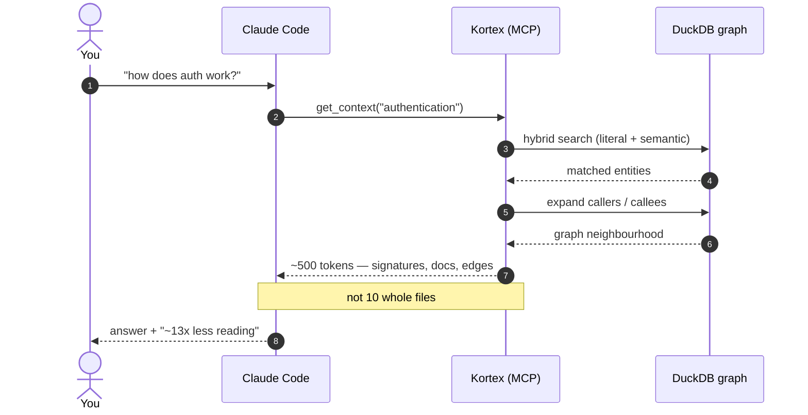
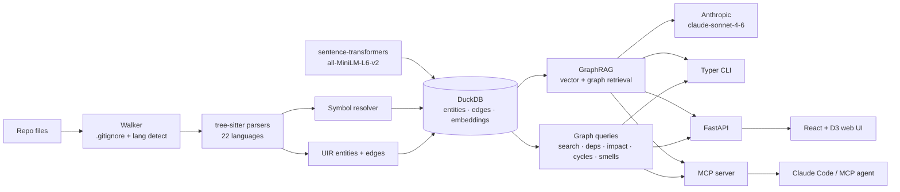

<div align="center">


<br>

### Cuts the tokens your AI coding agent burns reading your codebase.

**Index the repo once into a queryable graph — the agent looks things up instead of re-reading files.**

<br>


<br>

[**What it's for**](#-what-this-is-for) · [**Quickstart**](#-quickstart) · [**How the saving works**](#-how-the-token-saving-actually-works) · [**MCP tools**](#-mcp-tools) · [**Architecture**](#-architecture) · [**Benchmarks**](#-benchmarks) · [**FAQ**](#faq)

</div>

<br>

## 🎯 What this is for

**The problem:** your AI coding agent has no memory of your codebase. Every question starts
from zero — it greps, opens ten files, reads them end to end, and *still* can't see that the
function it just changed is called from three other places. Next message, it does the whole
thing again. On a large repo that's slow, expensive, and it fills the context window until
the agent forgets what you asked.

**What Kortex does:** it reads your repo **once** and builds a real graph of it — every
function, class, and module, plus who calls what and who imports what — into a single local
file. Then it hands your agent a tool that answers *"where is X and what touches it?"* in one
lookup, instead of a pile of file reads.

<div align="center">

| Without Kortex | With Kortex |
|---|---|
| Agent greps, opens 10 files, reads all of them | Agent makes **1 call**, gets the 3 things that matter |
| Cross-file relationships are guessed from imports | **Real call/import edges**, resolved across files *and* languages |
| Every question re-reads from scratch | The index **persists** — built once, reused every session |
| Context window fills with source it didn't need | Context stays small enough to keep the actual conversation |

</div>

**Who it's for:** anyone using Claude Code, Cursor, Codex, Gemini, or another MCP agent on a
codebase big enough that "just read the files" has started to hurt.

**The honest version:** on a small repo this is roughly break-even — the agent could have just
read the files. It pays off as the codebase grows and the questions get more cross-cutting.
Measured on a real ~1300-entity, 4-service repo: **14% cheaper overall**. On a 97,000-entity
repo (Grafana), the full round came back close to a tie — until it surfaced a real capability
gap, which got fixed the same day and turned the exact question that exposed it into a
**58% cheaper** win on re-test. Full numbers, including rounds where it came out worse, are in
[the cost findings](docs/COST_EFFICIENCY_FINDINGS_2026-07-10.md) — nothing swept under the rug.

<br>

> [!NOTE]
> **Status: active development.** Core indexing, search, and MCP tools are stable.
> 1276 tests passing. Every user-facing surface manually tested: 21/21 passed, 6 issues fixed.
> [Manual test →](docs/MANUAL_TEST_REPORT.md) · [Bench notes →](docs/QUALITY_REPORT_2026-07-01.md)
> The MCP server works but is still preview, not production-ready.

> [!TIP]
> **Everything runs on your machine.** The only network call is the Anthropic API for
> `ask` / `summarize` — both optional. All graph and search features work fully offline.

---

## 📚 In plain words

This codebase is like a **huge library full of books** (each file is a book).

<table>
<tr>
<td width="50%" valign="top">

### 🐢 Without Kortex

Every time you ask the AI a question, it grabs **armfuls of whole books** and flips through
all of them, every single time.

Heavy, slow — and it *still* struggles to see how one book references another.

</td>
<td width="50%" valign="top">

### ⚡ With Kortex

A librarian has already read every book once and built a **card catalog** — who mentions
whom, who calls what.

Now the librarian hands the AI just **the 2–3 exact pages that matter**, plus a sticky note
saying *"this page connects to that one."*

</td>
</tr>
</table>

So the AI reads a few index cards instead of hauling the whole library. That's the whole idea.

---

## 💡 How the token saving actually works

*(Read this — it's the honest version.)*

<div align="center">

</div>

There are **two different kinds of tokens**, and Kortex only touches one of them:

| Token type | What it is | Does Kortex reduce it? |
|---|---|---|
| **Reading tokens** (input/context) | How much code the AI has to *read* to understand your project | ✅ **Yes, a lot.** This is the whole point. |
| **Writing tokens** (output) | How much the AI *writes back* as its answer | ❌ **No.** That depends on your question, not on Kortex. |

**Why this matters for what you see:** the little token counter ticking in your chat is
mostly the AI's *thinking + writing*. Kortex does **not** shrink that. The saving happens in
the **reading pile** — the code that gets stuffed into the AI's context to answer you, which
you don't directly see on that counter.

**So is it worth it? Be honest with yourself:**

| Your situation | Verdict |
|---|---|
| 🤏 Tiny repo, one quick question | **Meh.** The saving is small and the answer's writing cost dominates. You won't feel it. |
| 🚀 Big codebase, long back-and-forth (10–20 questions) | **This is where it pays off.** Without Kortex the AI re-reads huge files again and again, cost piles up, and the context window fills until it forgets earlier parts. Kortex keeps every question at ~1–2k of reading. |

> [!IMPORTANT]
> **Note on the numbers.** The "Nx less" figures are Kortex's own estimate of
> *reading/context* tokens (4-chars/token heuristic, baseline = reading the full files the
> answer came from). They measure the reading pile, **not** your total turn, and **not**
> your actual $ cost — that also depends on round-trip count (each tool call re-reads the
> whole accumulated conversation from cache), which this estimate doesn't capture at all.
>
> A real controlled A/B ([full writeup →](docs/COST_EFFICIENCY_FINDINGS_2026-07-10.md)),
> measuring actual session `/usage` cost rather than estimated tokens, first caught this:
> a mandatory extra tool call and a bloated response payload made Kortex cost **34% more**
> real money than not using it at all on a 47-file repo, despite the "Nx less" number
> looking good the whole time. Both were implementation bugs, since fixed — a re-measurement
> after fixing them landed within ~3% either way (noise, not a real gap) on that same repo.
>
> Like the field's most mature comparable tool's own published numbers, $ cost savings are
> genuinely **scale-dependent**: closer to break-even on a small/medium repo, a clear win once
> a codebase (and the session count against it) gets large — and that's no longer just a claim
> borrowed from someone else's benchmark. A follow-up A/B on a real ~1300-entity, 4-service
> repo measured Kortex **14% cheaper overall**, losing only the question a well-written README
> already answered and winning the harder cross-file ones by a growing margin — first-party
> evidence the scale-dependence holds.
>
> A second, much larger test on Grafana (97,239 entities, 16,046 files — ~73x the repo above)
> came back close to a **tie** (-2.8%, inside noise for a 3-question sample) — Grafana ships
> unusually good per-directory `AGENTS.md` files already, so the without-Kortex baseline was
> stronger than usual. Digging into *why* one question lost surfaced a real gap: `impact_analysis`
> only walked the call graph, so asking "what breaks if I change this struct's shape" always
> returned zero results — correct given what it tracked, but easy to misread as "safe to
> change" when it actually meant "invisible to this tool." Fixed the same day: `impact_analysis`
> now searches for type usages (signature-text, word-boundary match over the same indexed data)
> when the resolved entity has no call-graph callers at all. Re-testing the exact question that
> exposed the gap, fresh session both sides: **58% cheaper** with Kortex, comparable answer
> quality either way. [Full story →](docs/COST_EFFICIENCY_FINDINGS_2026-07-10.md) — the near-tie
> is logged too, not just the number after the fix. Broader user testing is ongoing.

---

## 🚀 Quickstart

<table>
<tr><td>

**1 · Clone Kortex** *(one time, anywhere)*

```bash
git clone https://github.com/kunal202426/CodeGraph-Intelligence.git
cd CodeGraph-Intelligence
```

**2 · Install dependencies** *(one time, ~2 minutes)*

```bash
uv sync --extra dev
```

> First index also downloads the `all-MiniLM-L6-v2` embedding model (~80 MB), once. Kortex tells you when it starts.

**3 · Set up a project** *(once per project)*

```bash
cd /path/to/your/project
uv run codegraph init
```

**4 · Confirm it's wired** *(optional but reassuring)*

```bash
uv run codegraph doctor
```

**5 · Restart your agent** — the MCP server isn't loaded until it restarts. *(This is the #1 step people miss.)*

**6 · Just ask normally** — *"explain how authentication works in this project"*

</td></tr>
</table>

`init` does three things automatically:

- Indexes your code into `.codegraph/graph.duckdb` (~30 s for a medium project)
- Registers Kortex as an MCP tool in your agent (Claude Code / Cursor / etc.)
- Writes a `CLAUDE.md` guide that **requires** your agent to call Kortex before reading
  files, and to report the token savings back to you

It finishes by self-verifying the index (`Verified: N entities`). `doctor` prints a
`PASS`/`FAIL` line for the index, MCP config, agent guide, and freshness, with the exact fix
command for anything that needs attention.

Because of the guide, Claude calls `get_context` first (~500 tokens instead of reading your
whole codebase) and tells you the savings, e.g. *"CodeGraph: ~480 vs ~6,200 tokens (13x
less)"*. You don't need to remember any commands.

<details>
<summary><b>Prefer the pieces individually?</b></summary>

<br>

```bash
# Index a repo (writes .codegraph/graph.duckdb + embeddings)
uv run codegraph index /path/to/repo

# Search, explore, ask
uv run codegraph search "user authentication"
uv run codegraph impact authenticate
uv run codegraph ask "how does login work?"      # needs ANTHROPIC_API_KEY

# Browser UI: D3 graph + search + streaming AI chat
uv run codegraph serve

# Keep the index fresh as you edit
uv run codegraph watch .
```

Full command list via `uv run codegraph --help`: `init`, `doctor`, `index`, `search`, `deps`,
`impact`, `cycles`, `smells`, `deadcode`, `owner`, `layers`, `ask`, `summarize`, `context`,
`trace`, `status`, `watch`, `serve`, `install`, `uninstall`.

`init --target cursor|codex|gemini|kiro|opencode|hermes|antigravity` wires a different agent.

</details>

---

## 🔄 What actually happens when you ask a question


```mermaid
sequenceDiagram
    autonumber
    actor You
    participant Agent as Claude Code
    participant K as Kortex (MCP)
    participant DB as DuckDB graph

    You->>Agent: "how does auth work?"
    Agent->>K: get_context("authentication")
    K->>DB: hybrid search (literal + semantic)
    DB-->>K: matched entities
    K->>DB: expand callers / callees
    DB-->>K: graph neighbourhood
    K-->>Agent: ~500 tokens — signatures, docs, edges
    Note over Agent,K: not 10 whole files
    Agent-->>You: answer + "~13x less reading"
```

---

## ✨ What it does

| | Capability |
|---|---|
| 🕸️ | **Understands your code as a graph** — tree-sitter parses 22 languages into a unified entity/edge model (functions, classes, methods, modules + `imports`/`calls` edges), stored in a single DuckDB file with cross-file symbol resolution. |
| 🔍 | **Search by meaning, not just text** — local `all-MiniLM-L6-v2` embeddings + DuckDB vector search, fused with literal search via Reciprocal Rank Fusion. |
| 💬 | **Answers grounded questions** — GraphRAG retrieval (vector seeds + graph expansion) feeds `claude-sonnet-4-6` to answer "how does X work?" with `file:line` citations. |
| 📊 | **Analyzes structure** — dependency trees, reverse-call impact, import-cycle detection (Tarjan SCC), code-smell heuristics, dead-code candidates, git-blame ownership, architectural layer analysis. |
| 🎯 | **Resolves `obj.method()` to the exact class** — infers the receiver type from a local variable's constructor/annotation, a typed parameter, `self`/`this`, or a tracked `self.attr`, across all 8 OO-capable languages. Two unrelated classes sharing a method name no longer risk a wrong call edge; falls back to name-only resolution whenever the type isn't clear. |
| 🧬 | **Follows inherited methods** — if `method` isn't on `obj`'s own class, walks base classes/interfaces (or Go's embedded-struct promotion), same-file preferred when ambiguous. |
| 🌐 | **Resolves framework routing to real calls** — Flask, FastAPI, Express, Django, Spring, and Rails route handlers get real `calls` edges from their registration, so a handler invoked only through routing isn't false-positive dead code. A TS/JS `fetch`/`axios` call with a static URL resolves straight through to the backend handler — across files *and* languages, in one edge. |
| 🔁 | **Stays fresh automatically** — `codegraph watch` debounces filesystem events and re-indexes only changed files in ~300 ms. An opt-in git-hook fallback keeps the index fresh across commits, pulls, and checkouts where filesystem watching isn't reliable. |
| 🔌 | **Plugs into any MCP agent** — 12 MCP tools plus a one-command installer for 8 agents: Claude Code, Cursor, Codex, Gemini, Kiro, opencode, Hermes Agent, Antigravity. |

<details>
<summary><b>⚠️ What it cannot do</b> — being honest about the limits</summary>

<br>

- **Not a code reviewer**: it surfaces what is *relevant* to a question, not what is
  *correct*. It does not catch bugs or security issues.
- **It does not reduce the AI's *writing* tokens**, only the *reading/context* tokens (see
  [How the token saving actually works](#-how-the-token-saving-actually-works)). On a single
  small question the net difference can be marginal; the value compounds on large codebases
  and long sessions.
- **`codegraph ask` / `summarize` / `ask_codebase` are not free**: they call Anthropic's
  API and require a separate API key. The CLI warns you clearly if the key is missing.
- **No runtime understanding**: Kortex reads static structure (what calls what, what
  imports what). It does not know what happens when the code actually runs.
- **Inheritance walk has real edges but real limits**: `obj.method()` now resolves through a
  base class/interface (Python, TS/JS, Java, PHP, Ruby, C++) or Go's embedded-struct method
  promotion when `method` isn't declared on `obj`'s own type. Not covered: Ruby's `include`
  mixins (only `< Base` superclass syntax is captured), Rust (no inheritance concept — traits
  and default methods aren't walked), and multiple/diamond inheritance beyond a same-file or
  unambiguous repo-wide base — an ambiguous chain falls back to name-only resolution rather
  than guessing.
- **Framework resolution covers routing, not every framework feature**: Flask, FastAPI,
  Express, Django, Spring, and Rails route handlers resolve to real `calls` edges (same-file
  and cross-file), and a static-URL `fetch`/`axios` call resolves cross-language to the
  handler that serves it. Other framework-level relationships — Rails `has_many`
  associations, dependency-injection wiring, ORM relationship traversal — are not resolved.
  A route with a fully dynamic URL (built from string interpolation, not a literal) can't be
  matched and still shows as external.
- **Function-local imports**: if a function does `from X import Y` inside the function
  body (rare but valid Python), that call may not trace through to the definition.
- **One process per client, no shared daemon**: each connected agent window spawns its own
  MCP server process. The local DuckDB index is single-writer, so running `codegraph watch`
  and a heavy re-index simultaneously from two terminals may conflict. A shared multi-client
  daemon was scoped and deliberately not built — see [STATUS.md](STATUS.md).
- **Web UI is local-only**: `codegraph serve` opens a browser to `localhost`. It is not
  hosted, shared, or deployed anywhere.
- **22 languages**: Python, TypeScript, JavaScript, Go, Rust, Java, Ruby, PHP, C, C++,
  Kotlin, C#, Scala, Bash, Elixir, R, Julia, Haskell, OCaml, HTML, CSS, SQL. Other
  languages are silently skipped during indexing.

</details>

---

## 🔑 Do I need an API key?

**Short answer: No, for everything that matters.**

| Product | What it is | Free? |
|---|---|---|
| **Claude.ai subscription** (Pro/Team) | The claude.ai web/app interface | You already have it |
| **Anthropic API key** | Direct API access, billed per-token, from [console.anthropic.com](https://console.anthropic.com) | Separate, first ~$5 free |

These are **two different products**. Having a Claude subscription does not give you an API
key, and you do not need one to use Kortex's core features.

<table>
<tr>
<td width="50%" valign="top">

### ✅ Works free (no API key)

| Feature | Command / Tool |
|---|---|
| Index your codebase | `codegraph index`, `init` |
| Search by meaning + text | `codegraph search`, `search_code` |
| Understand dependencies | `codegraph deps`, `impact` |
| Cycles, smells, dead code | `cycles`, `smells`, `deadcode` |
| 11 of the 12 MCP tools | everything except `ask_codebase` |
| Auto-refresh as you code | `codegraph watch` |
| Browser UI with D3 graph | `codegraph serve` |

**The entire token-savings value proposition is free.**

</td>
<td width="50%" valign="top">

### 🔐 Needs an Anthropic API key

| Feature | Command / Tool |
|---|---|
| Natural-language Q&A | `codegraph ask "how does X work?"` |
| Architecture summary | `codegraph summarize` |
| GraphRAG Q&A in-agent | `ask_codebase` MCP tool |

Set `ANTHROPIC_API_KEY=<your key>` in your environment. You get ~$5 in free credits to start.

Without the key, `ask_codebase` is **hidden from the tool list entirely** rather than
advertised-but-broken — so it costs you no schema tokens.

</td>
</tr>
</table>

---

## 🧰 MCP tools

Kortex exposes **12 tools** over the [MCP](https://modelcontextprotocol.io) stdio protocol
(11 when no API key is set). Every description is written to tell the agent *when to prefer
it over reading files*.

| Tool | What it does |
|---|---|
| 🏁 `project_brief` | **Call once, first.** Cheap session-start orientation: layers, hot-path entities by call fan-in, HTTP entry points. |
| ⭐ `get_context` | **Start here for everything else.** Hybrid search + signatures + callers/callees, token-lean by default (`detail="full"` for bodies). Accepts a **list of up to 5 queries** in one call. Replaces 3–4 round-trips at ~10x fewer tokens. |
| 🔎 `search_code` | Hybrid literal + semantic search → entities with `file:line` |
| 📄 `get_entity_context` | Full source + neighbours (`depends_on`, `called_by`) for an `entity_id` |
| 💥 `impact_analysis` | For a function/method: reverse-call blast radius. For a struct/interface/type_alias (no callers, only field/param/return-type references): usages of that type instead. Resolves from an `entity_id` or a plain-text query. |
| 🧭 `trace_path` | Shortest call chain between two entities (BFS), by `entity_id` or plain-text query on either end, with readable labels |
| 📋 `list_files` | All indexed files with language, LOC, entity count; filterable by language |
| 📊 `index_status` | File / entity / edge / embedding / summary counts + staleness indicator |
| 🔄 `reindex` | Refresh only files changed since the last index, no terminal needed |
| 💬 `ask_codebase` | Natural-language question answered via GraphRAG with citations *(needs API key)* |
| 📝 `get_unsummarized_entities` | Hand the agent a batch of entities that still lack a summary |
| 💾 `store_summaries` | Write agent-authored summaries back + re-embed those entities *(no API key)* |

`CODEGRAPH_DB` overrides the discovered/default DB path.

<details>
<summary><b>🆓 Free, agent-driven summaries (no API key)</b></summary>

<br>

`get_unsummarized_entities` + `store_summaries` let **Claude Code itself** write the
per-entity "meaning" that powers semantic search, using your existing subscription instead of
paid API tokens. Run the bundled `/codegraph-summarize` command and the agent loops through
unsummarized entities, writes a one-line summary for each, stores them, and re-embeds just
those entities so search improves immediately.

The summary lives in the embed input, so a concept word that never appears in the code (e.g.
"rate limiting") still finds the right entity. Entities without a summary are byte-identical
to before; the feature adds **zero** overhead until you use it.

To run the MCP server manually (e.g. for a custom agent config):

```bash
# Discovers the nearest .codegraph/graph.duckdb from the working directory
python -m codegraph.server.mcp_server
```

</details>

---

## 🏗️ Architecture


```mermaid
flowchart LR
    repo[Repo files] --> walker[Walker<br/>.gitignore + lang detect]
    walker --> parsers[tree-sitter parsers<br/>22 languages]
    parsers --> uir[UIR entities + edges]
    uir --> store[(DuckDB<br/>entities · edges · embeddings)]
    parsers --> resolver[Symbol resolver] --> store
    embed[sentence-transformers<br/>all-MiniLM-L6-v2] --> store

    store --> queries[Graph queries<br/>search · deps · impact · cycles · smells]
    store --> rag[GraphRAG<br/>vector + graph retrieval]
    rag --> llm[Anthropic<br/>claude-sonnet-4-6]

    queries --> cli[Typer CLI]
    rag --> cli
    queries --> api[FastAPI]
    rag --> api
    api --> web[React + D3 web UI]
    queries --> mcp[MCP server]
    rag --> mcp
    mcp --> agent[Claude Code / MCP agent]
```

<details>
<summary><b>🧱 Stack</b></summary>

<br>

| Layer | Choice |
|---|---|
| Language / tooling | Python 3.11, [uv](https://github.com/astral-sh/uv), [ruff](https://docs.astral.sh/ruff/), pytest |
| Parsing | [tree-sitter](https://tree-sitter.github.io/): 22 languages — Python, TS/JS, Go, Rust, Java, Ruby, PHP, C, C++, Kotlin, C#, Scala, Bash, Elixir, R, Julia, Haskell, OCaml, HTML, CSS, SQL |
| Storage | [DuckDB](https://duckdb.org/): entities, edges, `FLOAT[384]` vectors, one file |
| Embeddings | [sentence-transformers](https://www.sbert.net/) `all-MiniLM-L6-v2` (local, 384-d) |
| LLM | [Anthropic](https://docs.anthropic.com/) `claude-sonnet-4-6` (prompt-cached) |
| Freshness | [watchdog](https://github.com/gorakhargosh/watchdog): debounced file watcher |
| CLI | [Typer](https://typer.tiangolo.com/) + [Rich](https://rich.readthedocs.io/) |
| Web | [FastAPI](https://fastapi.tiangolo.com/) + React 19 + Vite + [D3](https://d3js.org/) |
| Agent | [MCP Python SDK](https://github.com/modelcontextprotocol/python-sdk) |

</details>

---

## 🔬 Example queries

**Semantic search** finds code by intent, even when the words don't match:

```text
$ codegraph search "user authentication"
Type      Name          Location              Via              Doc
function  authenticate  auth/login.py:9       literal+semantic Validate credentials...
```

**Impact analysis** shows the reverse-call blast radius:

```text
$ codegraph impact authenticate
authenticate (function, auth/login.py:9)
+-- called by login_handler (method, api/users.py:26)
+-- called by submit (method, auth/login.py:38)
`-- called by boot (function, main.py:15)
Blast radius: 3 entities across 3 hop(s).
```

**Grounded Q&A** cites the actual entities it used:

```text
$ codegraph ask "how does login work?"
Login is handled by [py:auth/login.py:authenticate], which validates credentials
and is invoked by the API route [py:api/users.py:login_handler]...
```

---

## 📈 Benchmarks

Indexing [`tiangolo/fastapi`](https://github.com/tiangolo/fastapi) (1,122 files) on a laptop —
**6,065 entities, 14,601 edges**:

| Metric | Result |
|---|---|
| ❄️ Cold index (parse + resolve, graph only) | **~67 s** |
| 🔥 Warm re-index (no changes, hash-skip) | **~1.9 s** |
| ⚡ Literal search query | **<1 ms p50** / ~16 ms p95 (in-process) |
| 🧮 Embedding throughput | **~690 entities/s** (`all-MiniLM-L6-v2`, CPU) |
| 💾 Graph DB size on disk | **~34 MB** |

`search get_swagger_ui_html` → `fastapi/openapi/docs.py:40`. Warm re-index is ~35x faster
than cold thanks to per-file SHA-256 hash-skipping; embeddings re-compute only for entities
whose input changed. `ask` latency depends on the Anthropic API.

| | Result |
|---|---|
| **Dogfood** (Kortex indexing itself) | `get_context` returns **9.6x fewer tokens** than reading the matched files in full (1,108 vs 10,637 on one query). Across more queries: **101x average** (12x worst, 190x best). [Bench notes →](docs/QUALITY_REPORT_2026-07-01.md) · [Details →](docs/VERIFICATION.md) |
| **Search quality** | Hit@1 = **7/7** on symbol queries where the function name doesn't appear in the query string at all. Warm query ~15 ms. |
| **Real $ cost A/B** | On a ~1300-entity, 4-service repo: **14% cheaper overall**. On a 97,000-entity repo (Grafana): near-tie overall, but **58% cheaper** on the specific question that exposed a real gap and got a same-day fix. On a 47-file repo: break-even. [Full writeup →](docs/COST_EFFICIENCY_FINDINGS_2026-07-10.md) |
| **Tests** | **1276 passing**, 0 failures, 1 live-skip (needs an API key). Covers MCP tools, all 22 parsers, framework route resolution, receiver-type and inheritance-aware resolution, graph queries, CLI, all 8 installer targets. |
| **Manual test pass** | Every user-facing surface — CLI, web UI, watch daemon, MCP server (install, live query, uninstall) — run by hand. 21/21 passed; 6 issues logged. [Report →](docs/MANUAL_TEST_REPORT.md) |

---

## 🔌 Agent installer

`codegraph init` does everything; `codegraph install` wires just the MCP server into a
specific agent — no manual JSON editing either way.

```bash
uv run codegraph init                        # one-shot: index + install + CLAUDE.md
uv run codegraph install cursor              # wire a specific agent, no re-index
uv run codegraph install claude --print-config   # dry-run, print the JSON
uv run codegraph uninstall claude            # remove entry + CLAUDE.md block
uv run codegraph uninstall claude --purge    # also delete .codegraph/ + git hooks
```

| Target | Agent | Global config written |
|---|---|---|
| `claude` | Claude Code | `~/.claude.json` |
| `cursor` | Cursor IDE | `~/.cursor/mcp.json` |
| `codex` | OpenAI Codex CLI | `~/.codex/config.json` |
| `gemini` | Google Gemini CLI | `~/.gemini/settings.json` |
| `kiro` | Kiro | `~/.kiro/settings/mcp.json` |
| `opencode` | opencode | `~/.config/opencode/opencode.jsonc` |
| `hermes` | Hermes Agent | `~/.hermes/config.yaml` *(YAML, not JSON)* |
| `antigravity` | Antigravity IDE | `~/.gemini/config/mcp_config.json` |

**One install, every project.** By default no `--db` is written: the MCP server discovers the
nearest `.codegraph/graph.duckdb` from its working directory, so a single global entry serves
all your repos. Pass `--db <path>` to pin one. Use `--location local` for a project-scoped
config (`.mcp.json`, `.cursor/mcp.json`), and `--yes`/`-y` in scripts.

**Why Claude actually uses it.** Install also drops a managed block into your repo's
`CLAUDE.md` (idempotent `BEGIN/END` markers, never clobbers the rest) telling the agent to
call `project_brief` at session start and `get_context` *before* reading files. Without this,
an agent ignores the tools and keeps re-reading your source — so it's on by default
(`--no-guide` to skip).

---

## ✅ Before you start

**You need:**

| Requirement | Where to get it |
|---|---|
| Python 3.11 or newer | [python.org/downloads](https://python.org/downloads) |
| `uv` (Python package manager) | `pip install uv` or `brew install uv` on Mac |
| Git | [git-scm.com](https://git-scm.com) |
| A supported agent (at least one) | Claude Code, Cursor, Codex, Gemini, Kiro, opencode, Hermes Agent, or Antigravity |

**You do NOT need:** an Anthropic API key *(for the core features)*, any cloud account or
subscription beyond what you already have, or Docker.

---

<a id="changelog"></a>

<details>
<summary><h2>📜 Changelog</h2></summary>

<br>

**Aug 2026**

- Real, controlled A/B on an even bigger repo — Grafana (97,239 entities, 16,046 files). The
  round came back a near-tie (-2.8%) until digging into *why* one question lost surfaced a real
  gap: `impact_analysis` only walked the call graph, so a struct/interface (no callers, only
  field/type references) always reported `total: 0` — correct given what it tracked, but easy
  to misread as "safe to change." Fixed the same day: `impact_analysis` now searches for type
  usages when the resolved entity has no callers at all. Re-testing the exact question that
  exposed the gap: **58% cheaper** with codegraph, comparable answer quality both sides.
  [Full writeup →](docs/COST_EFFICIENCY_FINDINGS_2026-07-10.md)
- Fixed a genuine deadlock: loading the embedding model off the main thread while the MCP
  server's own event loop was running could freeze the whole process indefinitely — confirmed
  by direct reproduction (~31s completing synchronously vs. hanging 280s+ with zero progress
  dispatched through the real request-handling path). Now always loads synchronously before
  the event loop starts; the server no longer blocks its own handshake on a large repo's
  staleness scan either (backgrounded), so connecting doesn't time out just because the repo
  is big.
- `impact_analysis` and `trace_path` now accept a plain-text query instead of requiring a
  pre-resolved `entity_id` on both tools — collapses a `search_code` round-trip into the same
  call for the exact "what breaks" / "how does A reach B" questions that cost the most on a
  large, unfamiliar repo.
- `codegraph index` shows real progress — file-scan count, parse percentage, embedding ETA —
  instead of going silent for minutes on a large repo. Previously invisible outside a real
  terminal: a piped or logged run looked completely frozen even while it was actively working.
- `codegraph uninstall --purge` also removes `.codegraph/` and any installed git hooks, not
  just the MCP registration and guide — the cleanup a real test pass on someone else's repo
  actually needs, verified to never touch a foreign `CLAUDE.md` that predates codegraph.
- Real, controlled A/B on a genuinely large repo — JobHuntPro (1321 entities, 187 files, 4
  sub-apps, cross-language: JS Chrome extension + Node/Express + Python/FastAPI + React) —
  instead of the 47-file repo every earlier cost measurement used: **codegraph won overall,
  -14% $ cost**. It lost only the one question a well-written README already answered, and
  won both harder cross-file questions by a growing margin. First real evidence for the
  scale-dependence claim this project has cited since its own competitor research, not an
  assumption borrowed from someone else's numbers.
  [Full writeup →](docs/COST_EFFICIENCY_FINDINGS_2026-07-10.md)
- MCP server now watches its own parent PID and self-exits if the parent dies, instead of
  relying solely on stdio EOF — the root-cause fix for orphaned server processes holding the
  DB lock, which stdio EOF misses when a parent process tree is killed abruptly.
- `get_context` now accepts a list of up to 5 queries in one call — merged, deduped, fair
  round-robin across queries — instead of one call per name. The first fix aimed at cutting
  round-trip *count*, not just response size, which is what every earlier efficiency pass
  had been optimizing.
- New `project_brief` tool: a cheap, one-call session-start orientation summary (architecture
  layers, hot-path entities by call fan-in, HTTP entry points) — measured as a real, if
  modest, ~7% cost win in its own isolated A/B, with a higher cache-hit rate across the board.
- tsconfig/jsconfig `paths` alias resolution (`@/foo` imports) — previously an explicitly
  deferred TODO in this project's own resolver, silently losing cross-file edges on every
  Next/Nuxt/Vite-scaffolded repo indexed.
- Search re-ranked with identifier segmentation (`OrderStateMachine` now matches "state
  machine"), multi-term co-occurrence boosting, and down-ranking of test/fixture and
  generated files on a name collision — plus a bounded fuzzy-match fallback so a typo'd
  symbol name still finds its target instead of returning nothing.
- Fixed a real staleness bug found via manual testing: a repo with any vendored/minified
  file (extremely common) used to show a permanent "N file changed — re-index recommended"
  that no amount of re-indexing could ever clear, because the file was never given a row to
  begin with.
- `ask_codebase` is now omitted from the advertised tool list entirely when no
  `ANTHROPIC_API_KEY` is set, instead of being advertised-but-broken — measured ~9.7% off
  total tool-schema overhead for the common case.
- 1276 tests passing (up from 1114), zero regressions.

**Jul 2026**

- Battle hardening against real-world failure patterns (each confirmed reproducible before
  fixing): C++ forward declarations no longer indexed as duplicate classes; methods returning
  a reference (`const X& Get() const`) and conversion operators (`operator Type()`) — both
  previously dropped from the index entirely — now indexed correctly; `git blame` bounded by
  a timeout so a wedged git can't hang `codegraph owner`; the watcher quarantines a file
  after 3 consecutive re-index failures instead of retrying forever; generated/minified
  files (any source line over 10k chars) are skipped by both index paths.
- Inheritance-aware method resolution: `obj.method()` now also resolves when `method` is
  declared only on a base class/interface, not `obj`'s own type — a base-class edge per
  class (`extends`/`implements`/`< Base`/`: public Base`, plus Go's embedded-struct method
  promotion) resolved before calls, then a same-file-preferred walk up the chain. Covers the
  6 languages with real inheritance syntax plus Go; Rust has no inheritance concept.
- Receiver-type inference: `obj.method()` now resolves to the exact declared method instead
  of matching on the callee name alone, across all 8 OO-capable languages (Python, TS/JS,
  Java, Go, Rust, PHP, Ruby, C/C++). Infers the receiver's type from a local variable's
  constructor call or annotation, a typed parameter, `self`/`this`, or a tracked
  `self.attr`/`this.attr`/`@attr` — so two unrelated classes sharing a method name no longer
  risk a call edge pointing at the wrong one. Falls back to the old name-only resolution
  whenever the type can't be confidently inferred, so this never makes a result worse.
- 1114 tests passing (up from 1001), zero regressions across the pass — verified on both
  local runs and GitHub Actions (Linux), which caught and led to a fix for a genuine
  cross-platform ordering bug in multi-base inheritance resolution.
- Framework-aware call resolution: a route handler invoked only through Flask, FastAPI,
  Express, Django, Spring, or Rails routing now has a real `calls` edge instead of showing
  up as false-positive dead code with zero callers in `impact_analysis`. Resolves same-file
  and cross-file (the common case — `routes.rb` → a controller file, `urls.py` → `views.py`).
- Cross-language HTTP edges: a TS/JS `fetch()`/`axios.*()` call with a statically-known URL
  now resolves straight through to the backend handler that serves it, across both files and
  languages in one edge.
- `codegraph hooks install` adds an opt-in git-hook fallback (`post-commit`/`post-merge`/
  `post-checkout`) that re-indexes in the background, for environments where filesystem-watch
  events aren't reliable (mounted network drives, some WSL2 `/mnt` paths).
- Agent installer support doubled: 4 → 8 targets, adding Kiro, opencode, Hermes Agent, and
  Antigravity alongside Claude Code, Cursor, Codex, and Gemini.
- 1001 tests passing (up from 778), zero regressions across the pass.
- `get_context` now warns when your index is stale, and tells you how many files changed and
  to run `reindex` before trusting results. Previously you had to call `index_status`
  yourself to find this out, which most agents skip.
- 778 tests, 0 failures. Added 4 tests for the stale warning.
- Ran proper token savings numbers across queries on this repo: **101x average**
  (12x on a tiny single-function file at worst, 190x best case). One example:
  1,108 vs 10,637 tokens. [Bench notes →](docs/QUALITY_REPORT_2026-07-01.md)
- Hit@1 was 7/7 on symbol lookups where the function name doesn't appear in the
  query at all (pure semantic match).
- Warm query latency ~15ms; stale check is <1ms once the TTL cache is warm.
- `reindex` now cleans up entities for files deleted outside of `watch` (a plain `rm`, a
  branch switch), and the staleness cache is keyed on git HEAD so a branch switch doesn't
  hide staleness for up to 5 minutes. Full suite: 892 passing.

</details>

<a id="roadmap"></a>

<details>
<summary><h2>🗺️ Roadmap</h2></summary>

<br>

Phases 10-13 ("best of both"), 14-18 ("actually usable"), and the 19-22/24/26-28 competitive
hardening pass are complete:

- **Phase 10**: 9 languages: Go, Rust, Java, Ruby, PHP, C, C++ added to Python + TS/JS; extended to 19 with Kotlin, C#, Scala, Bash, Elixir, R, Julia, Haskell, OCaml; further to 22 with HTML, CSS, SQL
- **Phase 11**: `codegraph watch`: debounced file watcher re-indexes in ~300 ms; staleness guard on `serve`/MCP startup
- **Phase 12**: richer MCP tools + CLI mirrors (`context`, `trace`, `status`)
- **Phase 13**: agent installer for Claude Code, Cursor, Codex, Gemini
- **Phase 14**: *adoption gate*, directive tool descriptions + auto-written `CLAUDE.md` so agents actually use the tools
- **Phase 15**: *value gate*, token-lean `get_context` (summaries + token budget), readable labels; calling it is genuinely cheaper than reading files
- **Phase 16**: multi-project: walk-up DB discovery so one install serves every repo
- **Phase 17**: self-healing: a `reindex` MCP tool the agent can call to refresh a stale index from the chat
- **Phase 18**: first-run legibility (model-download notice), `codegraph init` one-shot, PyPI metadata
- **Phase 19**: precise per-file staleness signal in `get_context`, plus a real DuckDB connection-conflict fix
- **Phase 20-21**: framework-aware call resolution (Flask/FastAPI/Express/Django/Spring/Rails), cross-file route resolution, and cross-language HTTP edges (`fetch`/`axios` → backend handler)
- **Phase 22**: git-hook fallback (`codegraph hooks install`) for environments where filesystem watching isn't reliable
- **Phase 24**: agent installer breadth doubled, 4 → 8 targets (added Kiro, opencode, Hermes Agent, Antigravity)
- **Phase 26**: receiver-type inference — `obj.method()` resolves to the exact declared method (not just callee name) across all 8 OO-capable languages
- **Phase 27**: inheritance-aware method resolution — walks base classes/interfaces (or Go's embedded-struct promotion) when a method isn't declared on the receiver's own type
- **Phase 28**: battle hardening — C++ forward-decl/reference-return/conversion-operator index corruption fixed, git-blame timeout, watcher failure quarantine, generated/minified file skip

Deliberately **deferred**: deep TypeScript type resolution via `tsc`, Ruby `include`-mixin
inheritance and Rust trait default methods (receiver-type inference through inheritance
covers the rest), and a shared multi-client MCP daemon (one process per agent window today,
scoped and explicitly not built — a process-model change with more risk than the wins above).
See [STATUS.md](STATUS.md).

</details>

<a id="faq"></a>

<details>
<summary><h2>❓ FAQ</h2></summary>

<br>

**I have Claude Pro / Team. Do I need to pay extra?**

No. Your Claude subscription covers the claude.ai interface. Kortex's MCP integration
with Claude Code is completely separate and has no subscription cost. The only feature
that charges you separately is `codegraph ask` / `ask_codebase`, which hits the Anthropic
API directly — a different billing account at [console.anthropic.com](https://console.anthropic.com).

**Will it slow down Claude?**

The opposite. Claude makes 1 tool call (~500 tokens) instead of reading 10 files
(~10,000 tokens). Each message is faster and cheaper.

**Does it send my code to the internet?**

No. Everything runs on your machine. The index, embeddings, and graph all live in
`.codegraph/graph.duckdb` inside your project. The only network call is when you
explicitly use `codegraph ask` (which sends a few code snippets to Anthropic, the same
as any Claude Code conversation). The embedding model downloads once from HuggingFace
on first use, then works offline.

**How often do I need to re-index?**

You don't have to think about it. Run `codegraph watch .` in a terminal while you code;
it re-indexes only the file you just saved, in ~300 ms. Or skip it: if you forget, the
agent sees a `stale` warning and can call the `reindex` tool itself without you doing anything.

**Do I run `init` every time I open the project?**

No. Run `init` once per project, ever. After that, just start coding. The MCP entry is
global (written to `~/.claude.json` or equivalent); it is active every time Claude Code
starts, automatically.

**Which agents are supported?**

Claude Code, Cursor, OpenAI Codex CLI, Google Gemini CLI, Kiro, opencode, Hermes Agent,
and Antigravity. One command each:

```bash
codegraph install claude       # Claude Code
codegraph install cursor       # Cursor
codegraph install codex        # OpenAI Codex CLI
codegraph install gemini       # Google Gemini CLI
codegraph install kiro         # Kiro
codegraph install opencode     # opencode
codegraph install hermes       # Hermes Agent
codegraph install antigravity  # Antigravity
```

**Can I use it on multiple projects without reinstalling?**

Yes. Install once (`codegraph install claude`), and it works across every project. The
MCP server discovers the nearest `.codegraph/graph.duckdb` from wherever your agent is
running — no `--db` needed, no per-project config.

**Something went wrong during indexing. What do I do?**

The most common issues:
- *"Downloading embedding model..."* and it seems stuck — it's downloading ~80 MB, give
  it a minute. On slow/corporate networks this can take a while or fail; run
  `codegraph index . --no-embed` to skip it (you lose semantic search, keep literal).
- *"No graph database at..."* — run `codegraph index .` (or `codegraph init`) first.
- *Agent not using Kortex* — make sure you restarted the agent after `init`. Check
  that `CLAUDE.md` exists in your repo root with the `<!-- BEGIN CODEGRAPH -->` block.

</details>

---

## ⚖️ License & attribution

> [!WARNING]
> **Kortex is source-available, not open-source.** It is licensed under the
> [PolyForm Noncommercial License 1.0.0](LICENSE).

<table>
<tr>
<td width="50%" valign="top">

### ✅ You may

- Read the code, learn from it, and run it locally for your own work.
- Modify it and contribute changes back via pull requests.
- Use it personally, for research, hobby projects, study, or inside a nonprofit /
  educational / public-sector organization.

</td>
<td width="50%" valign="top">

### ❌ You may NOT

- Use it commercially: selling it, hosting it as a paid service, embedding it in a
  product you sell, or shipping it as part of a for-profit offering.
- Re-publish it under your own name, rebrand it, or claim it as your own work.

</td>
</tr>
</table>

**For commercial use,** contact me via my GitHub profile: [github.com/kunal202426](https://github.com/kunal202426).

Built and maintained by **Kunal Mathur**. Every source file carries an attribution header.
Please keep it intact in copies and forks.

---

## 🔭 Research

Comparable open-source tools tend to build a structural call graph without a semantic
layer, which caps how much re-reading and re-explaining they can actually save — and
handing a component shallow context with no surrounding meaning can lead a model to make
an incorrect edit. Kortex pairs a real dependency graph with embeddings-based semantic
search, aiming for a larger, more reliable token reduction than graph-only tools offer.

This specific combination — a codebase graph plus a semantic layer, evaluated on token
reduction — isn't something existing research covers directly, which is part of the
motivation for building it as a standalone tool.

## 🙏 Acknowledgments

Built on [tree-sitter](https://tree-sitter.github.io/), [DuckDB](https://duckdb.org/),
[sentence-transformers](https://www.sbert.net/), and the
[Anthropic API](https://docs.anthropic.com/). Progress tracked in [STATUS.md](STATUS.md).

<div align="center">
<br>
<sub>Built by <a href="https://github.com/kunal202426">Kunal Mathur</a> · <a href="STATUS.md">STATUS.md</a> · <a href="docs/COST_EFFICIENCY_FINDINGS_2026-07-10.md">Cost findings</a> · <a href="docs/MANUAL_TEST_REPORT.md">Manual test report</a></sub>
</div>
